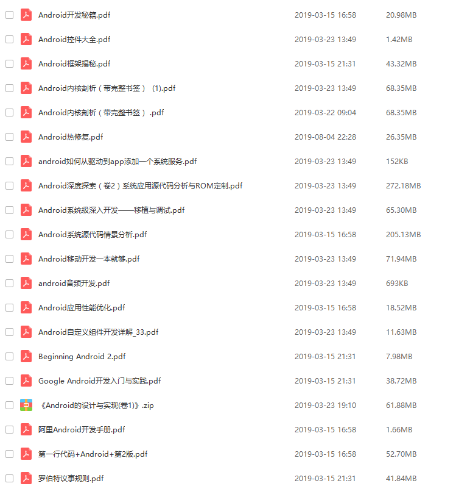
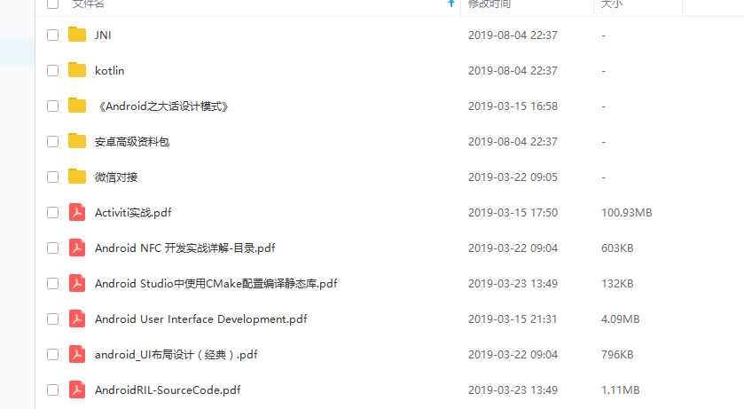
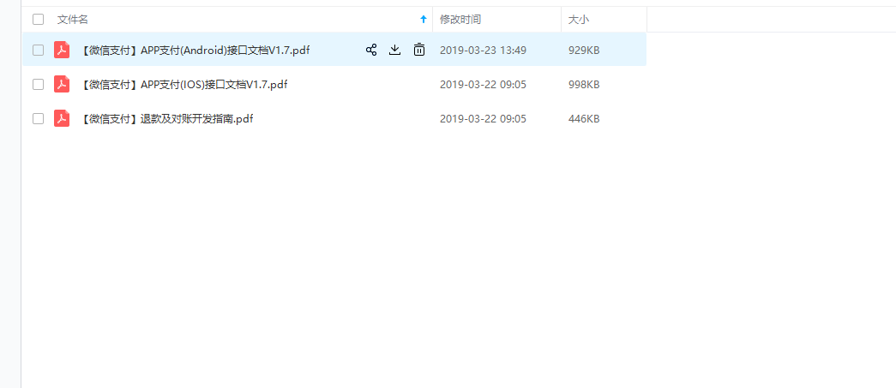
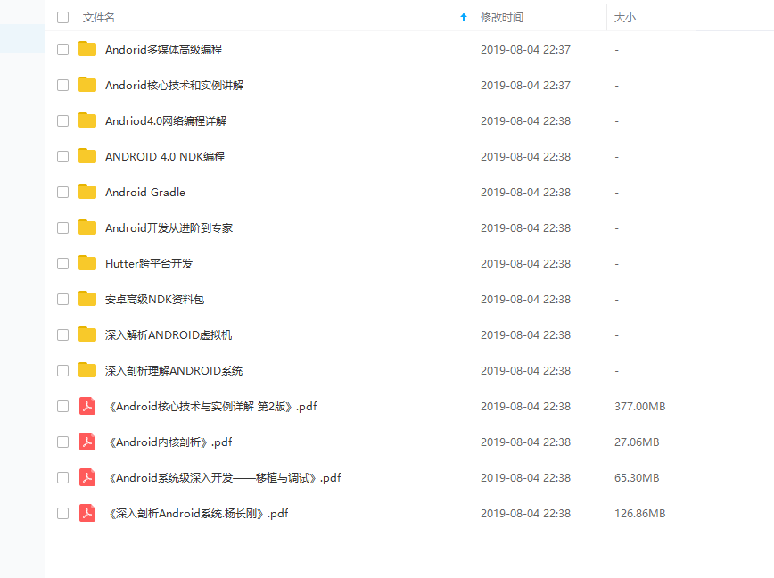
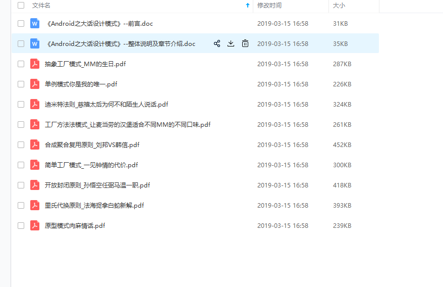
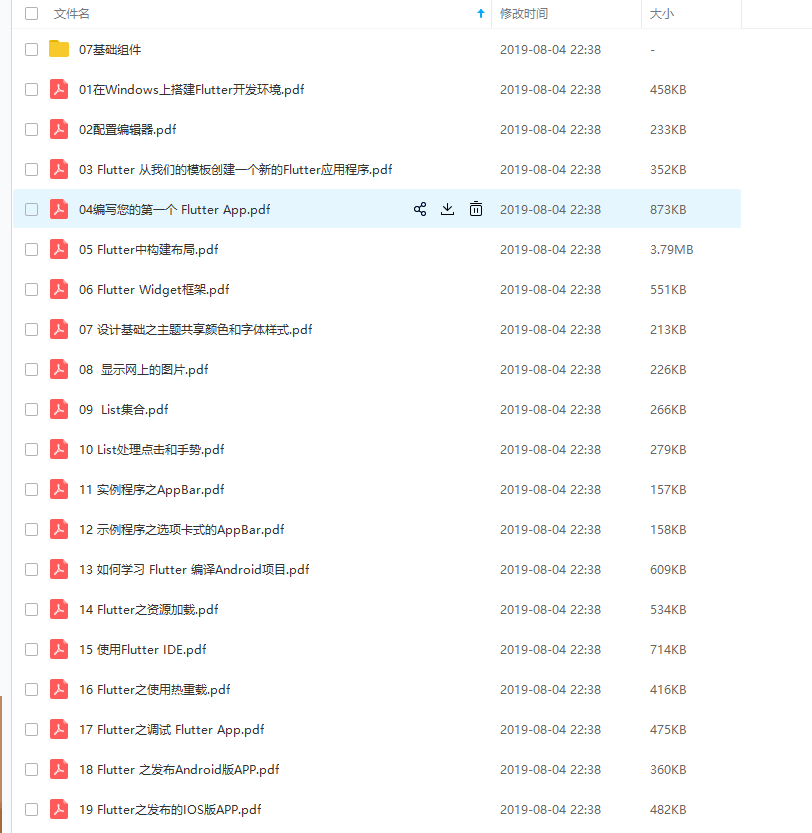
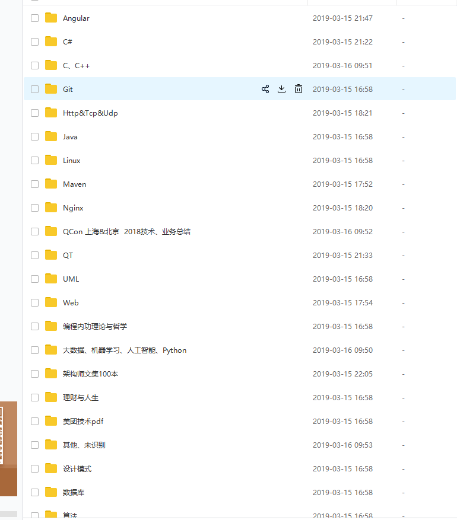
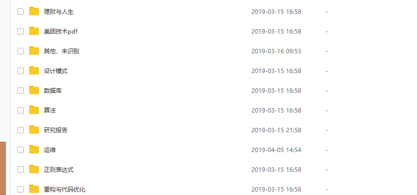

## Android 学习pdf.....

###  Android入门级优秀工具书：
1. 第一行代码+Android+第2版.pdf （一本android开发入门必看的丛书）->
    链接：https://pan.baidu.com/s/16xd56Kgo-6kTwZhCSvgm0Q 
    提取码：ouun 
2. 《Android开发进阶从小工到专家(书签版)》.pdf
       链接：https://pan.baidu.com/s/1fB6HzEqixUZCUzyp8EYbDQ 
       提取码：y5pi      
3. 阿里Android开发手册.pdf
    链接：https://pan.baidu.com/s/1iPH95oWWYL1bJ-NIH3rk6Q 
    提取码：mg3y 
4. Android移动开发一本就够.pdf ->
    链接：https://pan.baidu.com/s/19qskNm0GNZzpp7dPNfzwiQ 
    提取码：qizl  
5. Google Android开发入门与实践.pdf ->
   链接：https://pan.baidu.com/s/1KAtQsCeh6myetM5LV2LQLA 
   提取码：blky 
   
###  Android 进阶优秀工具书： 
1. Android应用性能优化.pdf
    链接：https://pan.baidu.com/s/1BjWQo4IGRn3reFlkkX04EQ 
    提取码：z378     
2. Android热修复及其原理
    链接：https://pan.baidu.com/s/1q7UI1VgizSiaj7jKF5orWg 
    提取码：45w5 
3. Android自定义组件开发详解.pdf
    链接：https://pan.baidu.com/s/1Ho7dOxpa9F5SdKL0sXtMwg 
    提取码：ki5k
4. Android框架揭秘.pdf
    链接：https://pan.baidu.com/s/1YJtLdxU2JTJHDKLCgDDLVg 
    提取码：eh56  
5. kotlin-in-chinese.pdf kotlin学习书籍
   链接：https://pan.baidu.com/s/1f0gBYIP3pLzduuDWsCrTBA 
   提取码：exfn 
6. Kotlin For Android(中文翻译).pdf
    链接：https://pan.baidu.com/s/1SdNp-v_SQmKa6NR04Iji4A 
    提取码：by1b 
       
7. 《Android系统级深入开发——移植与调试》.pdf
    链接：https://pan.baidu.com/s/1HvdWX-j0lk6ZKcj9Zyy1eg 
    提取码：35wa 
8. 《Android Gradle权威指南》.pdf
    链接：https://pan.baidu.com/s/1D06-PRaYTDmva5m3w-OR0Q 
    提取码：tkfo 
     
### Android 深入学习工具书：
1. 《Android内核剖析》.pdf
    链接：https://pan.baidu.com/s/1n0w4AgFycY0o_PzuMlhozg 
    提取码：nush 
2. 《深入理解ANDROID系统》.pdf
    链接：https://pan.baidu.com/s/19XP0sLzw2WmMOn0po4q6XQ 
    提取码：frdh 
3. 《深入解析ANDROID虚拟机》.pdf
    链接：https://pan.baidu.com/s/1jKRMHUQrXeGGweSyEAZRkg 
    提取码：x0rc 
4. Android C++高级编程  使用NDK  带书签目录 完整扫描版.pdf
    链接：https://pan.baidu.com/s/11l5Fc7sG7E4fHQ2mJGYRiQ 
    提取码：wias         
5. 《Android驱动开发与移植实战详解》.pdf
    链接：https://pan.baidu.com/s/1d0eEtJ1hgskYW955YXqryQ 
    提取码：0ao5 
6. 《深入剖析Android系统.杨长刚》.pdf
    链接：https://pan.baidu.com/s/12cwoxVCWces2SCTTpoNTHQ 
    提取码：d533 
 
 ###  pdf书籍截图整理： 有疑问和需要可以qq联系我：1690829596（忘了我是谁） 
 

    
    
    
 

 

     
     
     
 

 

    
    
    
  

## Android 最全的工具类封装.....
    Android开发人员应该收集以下utils（更新）-> 
    https://github.com/Blankj/AndroidUtilCode

## Android开源项目.....

### android  UI库
1.Android UI / UX库列表 ->
    https://github.com/wasabeef/awesome-android-ui

2.强大的 🚀 Android图表视图/图表视图库，支持线条-饼图 -雷达-气泡和烛台图表以及缩放，拖动和动画 ->
    https://github.com/PhilJay/MPAndroidChart

3.允许您使用滑入式菜单轻松创建应用的android库 ->
    https://github.com/jfeinstein10/SlidingMenu

4.在Android和iOS，Web和React Native上本地渲染After Effects动画 ->
    https://github.com/airbnb/lottie-android

5.适用于Kotlin和Android的漂亮，流畅且可扩展的对话框API -> 
    https://github.com/afollestad/material-dialogs

6.适用于Android的圆形ImageView ->
    https://github.com/hdodenhof/CircleImageView
    
7. Android 扫描二维码app. 在zxing的基础上优化了算法和相机处理
    https://github.com/xumingyi/CZXing
    
8. 提高 Android UI 开发效率的 UI 库--还不是很完善，缺少每一个UI 模块的小demo，整个demo掺杂在一起，拆分很费劲，可以练手学习， 一个缺少开源博客分块仔细写api说明的框架很难推广出去的，希望这两个库的开发团队能够做的更加高效细致
    https://github.com/Tencent/QMUI_Android
    https://github.com/xuexiangjys/XUI 
          

### android 架构：
1.一个整合了大量主流开源项目高度可配置化的Android MVP快速集成框架->
    https://github.com/JessYanCoding/MVPArms
2.Android中的MVVM架构（MVVM + Jetpack的开发实践）->
    https://github.com/qingmei2/MVVM-Rhine

### android  开发指南：
1.适用于Android的人员开发的广泛开源指南 ->
    https://github.com/codepath/android_guides 
    http://guides.codepath.com
      
### android 开源项目分类汇总：
 1.一个定期翻译、发布国内外Android优质的技术、开源库、软件架构设计、测试等文章的开源项目,让我们的技术跟上国际步伐 ->
    https://github.com/hehonghui/android-tech-frontier
 
 2.国内优秀的Android学习资源:
    https://github.com/hehonghui/android-tech-frontier/tree/master/the-bad-guys
 3.Android的开源项目，开源项目有详细资料和配套视频 ->
    https://github.com/Trinea/android-open-project
 
 4.Android的开源项目及库 ->
    https://github.com/Tim9Liu9/TimLiu-Android
 
 5.https://github.com/itheima1/Android

### 玩android网站
    https://www.wanandroid.com/article

### 程序员简历模板：
1.中文程序员简历模板系列 ->
    https://github.com/geekcompany/ResumeSample
    
    

